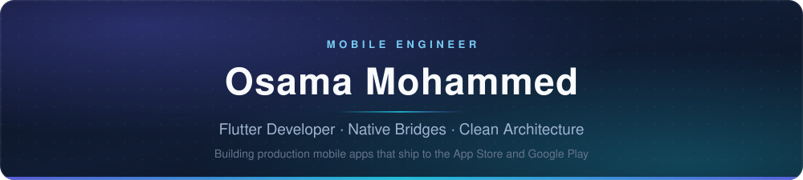

  

  
  
  
  

---

## About

I'm a **Flutter Developer at Bsma ERP**, where I build the mobile client for an enterprise ERP platform used to run daily business operations. My work centres on performance and stability — most recently I led a rendering overhaul that took the app from **25 FPS to a near-native 58 FPS**, a 132% improvement in perceived fluidity.

I hold a **BSc in Computer Science and Artificial Intelligence** from Beni-Suef University. Day to day I work in Flutter and Dart with Clean Architecture and state management in Riverpod and Bloc. Where cross-platform reaches its limits I bridge into native — writing custom Method Channels to execute platform logic and render native UI in **Kotlin/Jetpack Compose** and **Swift/SwiftUI** directly inside the Flutter view hierarchy.

My work spans academic research, logistics, real estate and consumer products. As the sole mobile engineer on **REFA**, I took a property rental platform from an empty repository to live releases on both the App Store and Google Play — interactive maps, deep linking, and an integrated payment gateway with custom instalment logic. Earlier I turned **GameChanger** from a research prototype into the company's flagship product, and engineered real-time eye-tracking applications with Google Machine Learning for **The American University in Cairo**, which I presented at the Cognitive Psychology Conference.

---

## Tech Stack

<table>
  <tr>
    <td valign="middle"><b>Core</b></td>
    <td>
      
      
      
      
    </td>
  </tr>
  <tr>
    <td valign="middle"><b>Native UI</b></td>
    <td>
      
      
      
      
    </td>
  </tr>
  <tr>
    <td valign="middle"><b>Architecture</b></td>
    <td>
      
      
      
    </td>
  </tr>
  <tr>
    <td valign="middle"><b>Backend &amp; Tools</b></td>
    <td>
      
      
      
    </td>
  </tr>
</table>

---

## Featured Projects

<table>
  <tr>
    <td width="50%" valign="top">
      <h4><a href="https://osama-site.web.app/?project=13">REFA</a></h4>
      Property rental platform taken from empty repo to live on the App Store and Google Play. Interactive maps, deep linking, and a payment gateway with custom instalment logic.
       <b>Flutter · Dart · Maps · Payments</b>
    </td>
    <td width="50%" valign="top">
      <h4><a href="https://osama-site.web.app/?project=10">GameChanger</a></h4>
      Research prototype rebuilt into the company's flagship product.
       <b>Flutter · Dart · Research → Product</b>
    </td>
  </tr>
  <tr>
    <td width="50%" valign="top">
      <h4><a href="https://osama-site.web.app/?project=12">Trex Logistic</a></h4>
      Mobile client for a logistics operation.
       <b>Flutter · Dart · REST APIs</b>
    </td>
    <td width="50%" valign="top">
      <h4><a href="https://osama-site.web.app/?project=6">FAIT — Fitness AI Trainer</a></h4>
      AI-assisted fitness training app.
       <b>Flutter · Machine Learning</b>
    </td>
  </tr>
  <tr>
    <td width="50%" valign="top">
      <h4><a href="https://osama-site.web.app/?project=9">Mulhum</a></h4>
      Cross-platform consumer app built end to end in Flutter.
       <b>Flutter · Dart</b>
    </td>
    <td width="50%" valign="top">
      <h4><a href="https://osama-site.web.app/?project=5">Attendfy</a></h4>
      Attendance tracking and reporting for teams and classes.
       <b>Flutter · Dart · Firebase</b>
    </td>
  </tr>
  <tr>
    <td width="50%" valign="top">
      <h4><a href="https://osama-site.web.app/?project=1">Job-Board</a></h4>
      Job listings, search and applications in a single mobile flow.
       <b>Flutter · Dart · REST APIs</b>
    </td>
    <td width="50%" valign="top">
      <h4><a href="https://osama-site.web.app/?project=0">Library Management System</a></h4>
      Catalogue, lending and member management.
       <b>Flutter · Dart</b>
    </td>
  </tr>
</table>

<a href="https://osama-site.web.app/">See the full portfolio →</a>

---

## Let's Connect

Open to collaborations, freelance work, and a friendly chat about mobile development.

  
  
  
  

